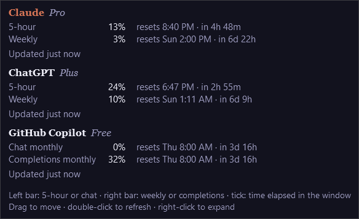
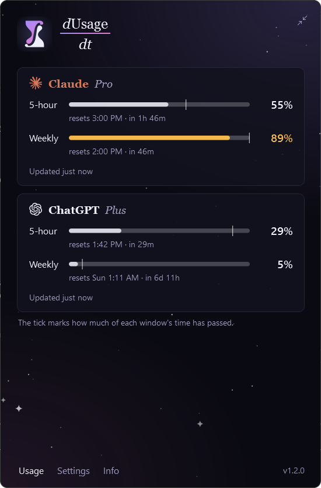
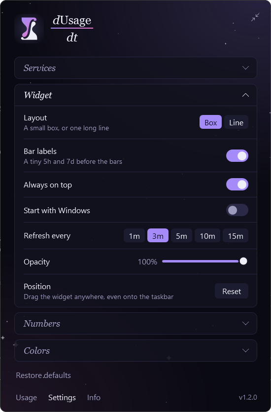

# dUsage/dt

A tiny always-on-top Windows widget that shows how much of your **Claude** and **ChatGPT** plan limits you've used: the 5-hour window and the weekly window, at a glance.


> **Made for Claude Code and Codex users.** dUsage/dt reads the sign-in that Claude Code and Codex save on your PC. If you only use claude.ai or ChatGPT in a browser, there's nothing for it to read.

## Install

Paste this into PowerShell on Windows 10 or 11:

```powershell
irm https://raw.githubusercontent.com/Decr0zeath/dusage-dt/main/install.ps1 | iex
```

No admin rights, and nothing else to install (.NET is built in). The command:

- downloads the latest release and checks its SHA-256
- installs it to `%LOCALAPPDATA%\Programs\dusage`
- adds a Start menu entry and an entry in Settings › Apps
- sets it to start with Windows, then starts it

**Updates:** dUsage/dt checks GitHub for a new version once a day. When there is one, the tooltip says so and the right-click menu and the expanded widget show **Update to …**. That runs the same installer in a PowerShell window, which checks the download, swaps the app and starts it again; your settings stay. You can turn the daily check off under Info in the expanded widget, and running the install command again always updates too.

**Downloading by hand instead?** Get `dusage.zip` from [Releases](https://github.com/Decr0zeath/dusage-dt/releases/latest), unzip it, and run `dusage.exe`. The app isn't code-signed, so Windows SmartScreen may say "Windows protected your PC"; choose **More info › Run anyway**. The install command doesn't hit that prompt. A copy set up by hand still tells you about new versions, but its button opens the download page instead of updating.

**Uninstall:** Settings › Apps › dUsage/dt › Uninstall. That removes the app, its Start menu entry, the start-with-Windows entry and its settings.

## Reading the widget

|                     | left bar      | right bar     |
| ------------------- | ------------- | ------------- |
| Claude logo         | 5-hour window | weekly window |
| OpenAI logo         | 5-hour window | weekly window |

- The number is the percent used (or, if you pick it in Settings, the percent left). A bar turns **amber at 75%** used and **red at 90%**; both are adjustable.
- The thin **tick** marks how much of the window's *time* has passed. If the fill runs past the tick, you're using the limit faster than the clock. When the numbers show what's left, the bars drain instead and the tick marks the time left, so a bar that falls short of its tick is running out early.
- A tiny **5h** or **7d** before each bar says which is which (you can switch them off).
- The rows above are the **Box** layout. **Line** puts the services side by side in one long row, which fits on the taskbar:

  

- A **faded logo** means that row couldn't update just now (for example, Claude Code's sign-in expired). The numbers are the last ones it got; hover to see why.
- A service you aren't signed in to doesn't appear at all.

Hover for details: reset times, plan, and when it last updated.



**Drag** to move it anywhere, even onto the taskbar. **Double-click** to refresh. **Right-click** for *Refresh now*, *Expand* and *Exit* (and *Update to …* when there is a new version). dUsage/dt's hourglass icon in the notification area has the same menu, and clicking it expands the widget.

## Expanded widget

Right-click the widget and choose **Expand**, click the tray icon, or launch dUsage/dt from the Start menu while it's running. The widget grows into a bigger panel in its place; the button in the top-right corner (or Esc) shrinks it back. That also brings back a widget you've lost track of.

 

Pick a page at the bottom left:

- **Usage:** every limit with a full-width bar, the percent used and when it resets, plus each service's plan and when it last updated.
- **Settings:** one section open at a time; click a title to open it. Changes apply immediately.
  - **Services:** switch Claude or ChatGPT on or off. If your plan has separate limits for particular models (for example, an Opus weekly cap on Claude Max), they appear under the service with their own switch, and turning one on adds a row for it.
  - **Widget:** the layout (a small box, or one line), the 5h/7d bar labels, always on top, start with Windows, how often to refresh (1–15 minutes), opacity (a slider from 100% down to 40%), and a button to reset the position.
  - **Numbers:** show the percent used or the percent left; the % sign on the widget; reset times as the time, a countdown, or both; and the pace tick.
  - **Colors:** switch the warning colors off, or choose when a bar turns amber (50–95% used) and red (55–100%).
  - **Restore defaults**, under the sections, puts every setting back as it came (click twice to confirm). Start with Windows stays as it is.
- **Info:** updates (check now, or switch off the daily check), credits, license, and the fine print.

To quit, right-click the tray icon (or the widget) and choose **Exit**.

Windows puts new tray icons in the **^** overflow. To keep the hourglass in view, drag it from there onto the taskbar.

## How it works

It asks each service for your usage every 3 minutes by default (every 15 while you're away from the PC), using the sign-in the CLI already saved:

|         | sign-in it reads                          | endpoint                             | same numbers as      |
| ------- | ----------------------------------------- | ------------------------------------ | -------------------- |
| Claude  | `%USERPROFILE%\.claude\.credentials.json` | `api.anthropic.com/api/oauth/usage`  | Claude Code `/usage` |
| ChatGPT | `%USERPROFILE%\.codex\auth.json`          | `chatgpt.com/backend-api/wham/usage` | Codex `/status`      |

(`CLAUDE_CONFIG_DIR` and `CODEX_HOME` are honored if you've set them.)

- **Claude:** its limits are shared by claude.ai, the desktop app and Claude Code, so this row covers all of them.
- **ChatGPT:** this row shows your ChatGPT plan's **Codex** limits. Those are the 5-hour and weekly windows ChatGPT has; regular ChatGPT chat doesn't expose a meter like this.

The sign-in files are **only ever read**. dUsage/dt never refreshes, copies or writes a token, and sends it only to the endpoint above, so it can't interfere with Claude Code or Codex. The trade-off: Claude Code's sign-in expires a few hours after you last used Claude Code. Until you use it again, the Claude row keeps its last numbers with a faded logo. A bar whose reset time passes still drops to 0.

Both endpoints are the ones the official CLIs call. They aren't a documented public API and could change. If numbers stop appearing, run the probe below.

Settings and the last fetched numbers live in `%LOCALAPPDATA%\dusage`. No tokens are stored there.

## Troubleshooting

```powershell
& "$env:LOCALAPPDATA\Programs\dusage\dusage.exe" --probe | Out-String       # fetch once and print what the widget would show
& "$env:LOCALAPPDATA\Programs\dusage\dusage.exe" --probe-raw | Out-String   # also print each response's layout (ids and emails redacted)
```

Unexpected errors are logged to `%LOCALAPPDATA%\dusage\error.log`.

## Build from source

You need the .NET 10 SDK.

- `build.cmd` produces `dist\dusage.exe`, a single file with .NET built in.
- `dotnet run --project src/Dusage` runs it while you work on it. Exit a running widget first, since only one copy runs at a time.
- Pushing a tag such as `v1.2.0` runs [the release workflow](.github/workflows/release.yml). It builds `dusage.zip` and publishes a GitHub release, which the install command picks up.

The app is a small WPF project in `src/Dusage`:

- `ClaudeSource.cs` and `CodexSource.cs` fetch usage. To add a service, implement `IUsageSource` and give it a logo in `Logos.cs`.
- `MainWindow` is the widget.
- `ExpandedWindow` is the expanded widget: every limit in full, plus Settings and Info.
- `TrayIcon.cs` is the icon in the notification area.
- `Updater.cs` checks for and installs new releases; `Palette.cs` holds every color; `Sky.cs` draws the starry backdrop behind the expanded widget.

## License

[MIT](LICENSE) © Decr0zeath. Made with Claude.

Not affiliated with Anthropic or OpenAI. Claude is a trademark of Anthropic, PBC; ChatGPT and Codex are trademarks of OpenAI. The logos come from [Simple Icons](https://simpleicons.org) (CC0).

The icon is an hourglass split by an integral sign: time running out, and ∫ usage dt. Nebula above, starlight below, in deep space like the rest of the app.
